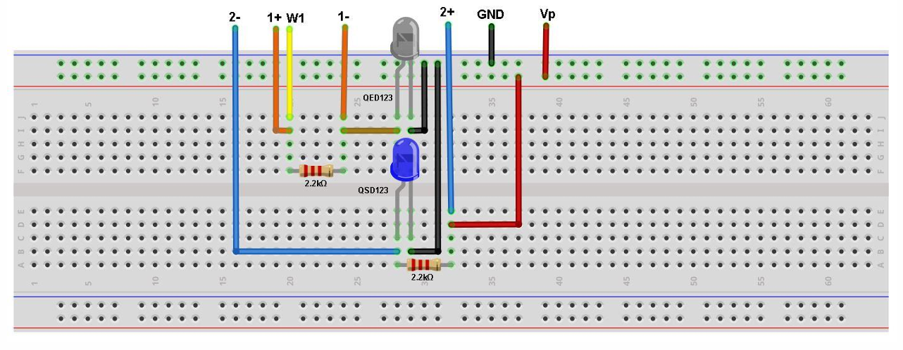

# Optocoupler-Based Signal Isolation Circuit using IR LED and NPN Phototransistor

This repository contains the documentation and hardware implementation of a simple optocoupler circuit constructed using an IR LED and an NPN phototransistor. This project was carried out as part of the "Introduction to Electrical and Electronics Engineering" course.

## 📚 Project Overview

Optocouplers, also known as optoisolators, are used to electrically isolate sections of a circuit while allowing signal transmission through light. In this project, we demonstrate the working of a basic optocoupler using:
- QED123 Infrared LED
- QSD123 Phototransistor

We explore how optical isolation helps in safeguarding components from high voltages, spikes, and interference, while maintaining signal integrity.

## 🛠 Materials Used

- ADALM2000 Active Learning Module
- Solderless breadboard
- Jumper wires
- 2 × 2.2 kΩ resistors
- 1 × OP27 Operational Amplifier
- 1 × QED123 IR LED
- 1 × QSD123 Phototransistor

## 🧰 Hardware Setup

Below is an image of the hardware setup used in this project:

> ⚠️ Make sure to add the image under a folder named `images/` in your repo.

## 📐 Construction Steps

1. Align the IR LED and phototransistor facing each other on a breadboard.
2. Wrap the pair in black tape to block ambient light.
3. Connect the LED to the input side and phototransistor to the output.
4. Set up the circuit using the ADALM2000 module.
5. Observe the output characteristics while varying the input.

## 🔍 Applications

- Power electronics
- Medical devices
- Industrial automation
- Motor control systems
- Renewable energy systems

## ✅ Features

- Provides galvanic isolation
- Enhances signal integrity
- Low power and compact design
- Reliable operation in noisy environments

## ⚠️ Limitations

- Limited bandwidth
- Sensitive to temperature and ambient light
- Finite response time
- Possible aging and degradation

